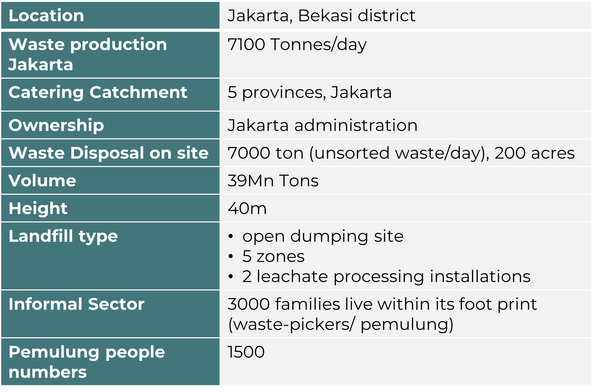
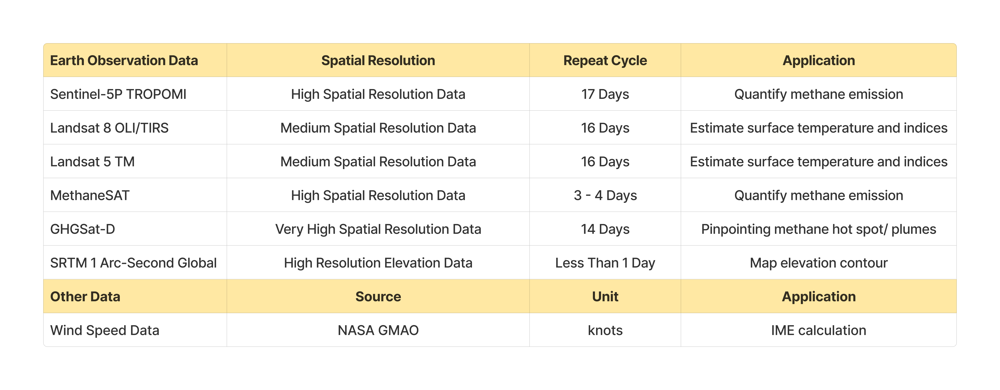
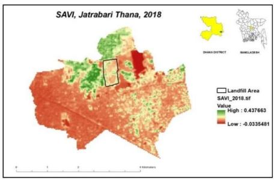
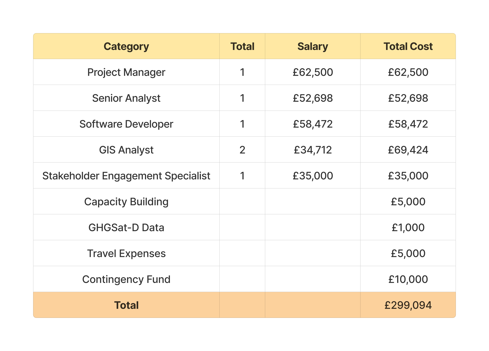

class: center middle
```{r setup, include=FALSE}
options(htmltools.dir.version = FALSE)
```

```{r xaringan-themer, include=FALSE, warning=FALSE}
library(xaringanthemer)
style_duo_accent(
  primary_color = "#327CA7",
  secondary_color = "#FFC94A",
  inverse_header_color = "#1C5174",
  inverse_text_color = "#1C5174",
  header_font_google = google_font("Ubuntu", "500"),
  text_font_google   = google_font("Montserrat", "400", "400i"),
   text_font_size = "1rem",
  code_font_google   = google_font("Fira Mono"),
  title_slide_background_image = "img/bantargebang.jpeg"
)
```

```{r xaringan-all, echo=FALSE}
library(countdown)
library(xaringan)
library(xaringanExtra)
library(knitr)
hook_source <- knitr::knit_hooks$get('source')
knitr::knit_hooks$set(source = function(x, options) {
  x <- stringr::str_replace(x, "^[[:blank:]]?([^*].+?)[[:blank:]]*#<<[[:blank:]]*$", "*\\1")
  hook_source(x, options)
})

xaringanExtra::use_tile_view()
xaringanExtra::use_broadcast()
xaringanExtra::use_panelset()
xaringanExtra::use_tachyons()
xaringanExtra::use_search(show_icon = TRUE, auto_search = FALSE)
xaringanExtra::use_progress_bar(color = "#FFC94A", location = "bottom")
```

```{r load_packages, message=FALSE, warning=FALSE, include=FALSE}
library(fontawesome)
```

# Landfill Methane Emission

---
class: inverse center middle

# Problem Identification

---
class: inverse center middle


Source:<a href="https://www.vice.com/en/article/7x54jd/the-worlds-largest-dump-is-in-indonesia-and-its-a-ticking-time-bomb">vice</a>

Nope! Not the world's....South East Asia's
---

## Context

.panelset[
.panel[.panel-name[Indonesia]
.pull-left[


.left[Ref:<a href="https://thedocs.worldbank.org/en/doc/7c9b64c34a8833378194a026ebe4e247-0140022022/related/HCI-AM22-IDN.pdf ">worldbank</a>; <a href=" https://www.worlddata.info/asia/indonesia/index.php#:~:text=INDONESIA%2C%20the%20largest%20archipelago%20in,which%20about%206%2C000%20are%20inhabited. ">worlddata</a> <br> 

]
]
.pull-right[

.right[Source: <a href="https://www.burningcompass.com/on-world-map/indonesia-on-world-map.html
 ">burningcompass</a> <br> ]

]
]
.panel[.panel-name[Waste Management]
.pull-middle[

.right[Ref: <a href="https://pdf.usaid.gov/pdf_docs/PA00XWPP.pdf ">usaid</a> <br> ]
]


.panel[.panel-name[Landfill]

.pull-left[


Source: <a href=" https://sipsn.menlhk.go.id/sipsn/public/data/komposisi">sipsn</a>
]
.pull-right[
- Collection: primarily by Local authorities, Informal sector, Waste Bank and Private collection

- Total Landfills= 380 nos. (area~ 8200 Ha)

- Waste Bank (Success story): Satu Hati Waste Bank in West Jakarta, established in April 2017 ( (US$511,736) in profits)

- MSW managed by Seksi Kebersihan (Cleansing Dept. in each district)

- Predominant waste type: Food waste and Plastic waste

]

.panel[.panel-name[Bantargebang Landfill-1]
.pull-left[
 

]
.pull-right[
 

Source: <a href=" https://ijtech.eng.ui.ac.id/article/view/4571 ">ijtech</a>


]
.panel[.panel-name[Bantargebang Landfill-2]


Ref: <a href=" https://www.ncbi.nlm.nih.gov/pmc/articles/PMC9325652/">ncbi</a>; <a href=" https://ejatlas.org/conflict/bantar-gebang-jakarta-landfill-indonesia ">ejatlas</a>; <a href=" https://iopscience.iop.org/article/10.1088/1755-1315/940/1/012028/pdf ">iopscience</a>; <a href=" https://upstdlh.id/tpst/landfill ">ejatlas</a>


]
]
]
]
]


---
## Why is it Important

.panelset[
.panel[.panel-name[Policies]

.left[Ploicy Ref: <a href="https://pdf.usaid.gov/pdf_docs/PA00XWPP.pdf">Policies</a>;<a href="https://www.ilo.org/dyn/natlex/natlex4.detail?p_lang=en&p_isn=84427&p_country=IDN&p_count=611">WasteLaw2008</a>;<a href="https://humanrightspapua.org/wp-content/uploads/2021/03/images_docs_Indonesian_Law_32-2009_Environment.pdf ">LawEPM2009</a>;<a href="https://www.global-regulation.com/translation/indonesia/7208771/government-regulation-number-81-in-2012.html ">MHHW2012</a>;<a href="http://www.vertic.org/media/National%20Legislation/Indonesia/ID_Regulation_Waste_19_1994.pdf">RHWM</a>;<a href="https://faolex.fao.org/docs/pdf/ins137639.pdf ">PRT2013</a>;<a href="https://www.acccrn.net/sites/default/files/publication/attach/ran-api_english_translation.pdf ">RANAPI2015</a>;<a href="https://kkp.go.id/an-component/media/upload-gambar-pendukung/djprl/P4K/Pencemaran%20Laut/Marine%20Debris/03.%20Perpres%20Nomor%2097%20Tahun%202017%20-%20Jakstranas.pdf">NPM</a>;<a href="https://wedocs.unep.org/bitstream/handle/20.500.11822/32898/NPWRSI.pdf?sequence=1&isAllowed=y ">NPWR2020</a>;<a href="https://drive.esdm.go.id/wl/?id=NMWtlg7uDxwXTf1bDxgrren7d8x6y5Iu&mode=list&download=1 ">WE</a>;<a href="https://unfccc.int/sites/default/files/NDC/2022-09/23.09.2022_Enhanced%20NDC%20Indonesia.pdf ">ENDC2022</a>;<a href="https://www.basel.int/Portals/4/Basel%20Convention/docs/text/BaselConventionText-e.pdf ">Basel2005</a>;<a href="https://jdih.kemendag.go.id/backendx/image/regulasi/22200711_Permendag_No._31_tahun_2016.pdf">wasteImport</a>;<a href="https://documents1.worldbank.org/curated/en/781051510608417715/Environmental-and-social-management-framework.pdf">SWMS2019</a>;<a href="https://drive.google.com/file/d/16WhKUeXjd7LnpiVJADhFtye8w-4G9aHj/view">MoEF2019</a>; <a href="https://www.wwf.id/upload/2023/03/WWF-EPR-Guideline-2022-ENG-final.pdf">EPR2015</a> 
]

]
.panelset[
.panel[.panel-name[Summary]
.pull-center[
- Target of 30% waste reduction and 70% waste handling by 2025

- Indonesia aims to reduce marine plastic litter by 70% relative to business as usual by 2025

- Indonesia committed to reduce greenhouse gas emission by 29% (2030) and 41% (conditional target, with international support) 
<a href="https://www.oecd.org/ocean/topics/ocean-pollution/marine-plastics-pollution-Indonesia.pdf">OECD</a> <br>
- Government: enhancement of SWM and Environmental Improvement

- Focus on waste reduction and management Plan, 'reuse and recycle'

- Policies emphasise monitoring waste-associated activities (Generation, collection, reduction, disposal, recycling etc.)

- Based on the monitoring of waste-associated activities evaluation step is to be conducted. 

- _Gerakan Pilah Sampah_: waste sorting at source > Circular Economy

- **ADIPURA Programme**, MoEF (incentive to Municipalities):Environmental Management, Cleanliness and Operation of final disposal site. 

]
.panel[.panel-name[Gap]
.pull-left[


]


.pull-right[

Source: <a href="https://wedocs.unep.org/bitstream/handle/20.500.11822/32898/NPWRSI.pdf?sequence=1&isAllowed=y ">unep</a>
]

.panel[.panel-name[GHG-1]

**GHG Emissions from Waste Management, 2015** Source: <a href="file:///C:/Users/diana/Downloads/Waste%20to%20Energy%20Guidebook%20-%20English%20Version%202015%20(9).pdf">WTE</a>

- _Coordinator_ : Ministry of Environment and Forestry (MoEF)—Directorate of Waste Management; MSW: Directorate for Waste Management, MoEF and Directorate for Development of Environmental Sanitation and Housing Ministry of Public Works and Housing (MPWH)

- Monitoring waste tipping operations (checking for combustible loads), providing fire-fighting equipment (to quickly extinguish
any fires encountered) and **constantly observing the landfill for any signs of sub-surface fires** are all good management practices to prevent and control landfill fires and thereby minimise their associated negative impacts.

- Identification of credible LFG WtE projects will therefore **require a significant amount of research and effort to find the landfills with the highest WtE potential**. It should be assumed, therefore, that **full and extensive baseline surveys** will be required.

Source: <a href="https://wedocs.unep.org/bitstream/handle/20.500.11822/32898/NPWRSI.pdf?sequence=1&isAllowed=y ">unep</a>
]

.panel[.panel-name[GHG-2]
**Enhanced Nationally Determines Contribution, Republic of Indonesia, 2022** Source: <a href= "https://unfccc.int/sites/default/files/NDC/2022-09/ENDC%20Indonesia.pdf">ENDC</a>

- The Government of Indonesia (GoI) has ratified the Paris Agreement (PA) and has submitted its commitment to reduce greenhouse gas emissions with an unconditional target of **29%** and conditional target (with international support) of 41% compared to business as usual (BAU) emission levels by **2030**

- Dashboard AFOLU for land-based sector (4.4)

- First Order Decay-FOD (IPCC-2006) and existing regulation for waste sector Challenges.

- Greenhouse gas emissions will reach a **peak of 1,240 million tonnes of CO2e by 2030** and then gradually decline to reach 540 million t CO2e in 2050. It is expected that net zero emissions will be achieved by 2060 or earlier


Source: <a href="https://unfccc.int/sites/default/files/NDC/2022-09/ENDC%20Indonesia.pdf">unfcc</a>
]
.panel[.panel-name[GHG-3]
**Operational Plan Indonesia’s FOLU, 2030** Source: <a href="https://www.menlhk.go.id/uploads/site/post/1647334063.pdf">FOLU2022</a> ; <a href="https://unfccc.int/files/national_reports/non-annex_i_natcom/cge/application/pdf/waste_sector_2016_lesotho.pdf">unfccc</a>

-	MoEF's Geospatial Information Network (JIG) and integrated with the National JIG. This activity includes institutional monitoring in reporting plans and implementation of emission reduction activities and their achievements on a regular basis.

**Indonesia Third Biennial Update Report- 2022** Source: <a href="https://unfccc.int/sites/default/files/resource/IndonesiaBUR%203_FINAL%20REPORT_2.pdf">unfccc</a> ; 

- MoEF Regulation(ADIPURA) where Cities and Regencies included in the ADIPURA Program also have to report their waste management...The **ADIPURA database**, especially with respect to the MSW generation and management of stream, has been **used to estimate the GHG emissions since 2003**. After 2014, this database was enhanced by the inclusion of **more cities with higher MSW coverage** with at least 80% of the national MSW generated. 

- 2019, GHG emissions from the SWDS amounted to 38,487 (87.9% of total emissions from MSW treatments), open burning was 5,296 Gg CO2e (12.1%), and composting was 2.16 Gg CO2e (0.005%).

- National Registry System for Climate Change (NRS-CC) (web-based system that manages and provides data and information on national mitigation and adaptation activities). In Appendix- 4 (refers to (JAKSTRANAS and ADIPURA database)

]

.panel[.panel-name[FOCUS]
.pull-center[
**Portrait of 5 (Five) TPA Utilizing Methane Gas (CH4)** Source: <a href="https://ejurnal.bppt.go.id/index.php/JTL/article/download/437/337/697">bppt</a> ; 

How is CHG measured under ADIPURA data base? (open dumping > predominently no collection and ventilation system)

landfill without gas recovery infrastructure
- Drilling into the landfill as deep as the thickness of the refuse layer.
- inflow of gas = Perforated pipe with certain diameter is inserted.
- The perforated pipe circulated with gravel is performed in order to protect the blocking by refuse particles
- The gas analyzer used for CH4 , CO2  and O2 measurement (portable)

**Issue with the above approach**
- No gas recovery infrastructure prepared (open dumpsite)
- Gas generation fluctuates from one place to another
- measurement window: 5-10 years
]

.panel[.panel-name[AIM]
.pull-center[


Use Remote sensing as a solution to measure emissions, surface temperature and surrounding vegetation in landfill sites. 


]
]
]
]
]
]
]
---
class: inverse center middle

# Approach

---

##Interactive Dashboard
```{r xaringan-panelset, echo=FALSE}
xaringanExtra::use_panelset()

```
.panelset[
.panel[.panel-name[Introduction]
.pull-left[
**Objective<br/>**
- Monthly monitoring on the emission and surface temperature of Bantargebang Landfill
- Monthly environmental impact assessment at and around the landfill site
- Effective dissemination of information on the latest situation


**Website<br/>**
Official Jakarta Waste Management Portal <br/> 'e-Monitoring for Bantargebang Landfill'

**Parameters**
- Methane Emission
- Surface Temperature
- Environmental Monitoring 
]

.pull-right[

]
[Source: Jakarta Waste Management Portal](https://upstdlh.id/tpst/landfill#)
]

.panel[.panel-name[Methods]

]

.panel[.panel-name[Dataset]

]

]
---
## Methane Emission
.pull-left[
**Input:<br/>**
1. TROPOMI Methane Product <br/>
2. GHG-D Methane Data 

**Process:<br/>**
1. Emission quantification: <br/>
filtered by methane precision, SWIR cloud fraction, SWIR aerosol optical depth & SWIR albedo 

2. Identify region of interest by oversampling

3. Pinpoint the methane hotspot with GHGSat-D

4. Emission quantification from integrated mass enhancement (IME) calculation

**Output:<br/>**
1. Emission Map
2. Total Methane Mass Estimation
]

.pull-right[
]
]
[Source: Maasakkers et al., 2022](https://www.science.org/doi/10.1126/sciadv.abn9683)
]
---
## Surface Temperature
.pull-left[
**Input:<br/>**
1. Landsat 8 thermal infrared band<br/>
2. Landsat 5 thermal band
3. SRTM DEM data

**Process:<br/>**
1. Land Surface Temperature<br/>
Apply scale factor to convert from Kelvin to Celcius

2. Supervised pixel-based classification<br/>
  - Google Earth historical images
  - Technical guidelines 
3. Reproject DEM data and create contour

**Output:<br/>**
1. Thermal Map
2. Land Cover Change Analysis
]

.pull-right[
]
]
]
[Source: Hanami et al., 2022](https://iopscience.iop.org/article/10.1088/1755-1315/1117/1/012055/meta)
---
## Surface Temperature
]
[Source: Hanami et al., 2022](https://iopscience.iop.org/article/10.1088/1755-1315/1117/1/012055/meta)
---
## Environmental Monitoring
.pull-left[
**Input:<br/>**
1. Landsat 8 NIR & Red bands<br/>
2. Landsat 5 NIR & Red bands

**Process:<br/>**
1. Image clipping

2. Extract indicies with band math
  - Normalized Difference Vegetation Index
  - Soil Adjusted Vegetation Index
  - Modified Soil Adjusted Vegetation Index

**Output:<br/>**
1. Reclassified image for NDVI, SAVI & MSAVI
2. Time series analysis on percentage variation of different category
]

.pull-right[
]
]
]
[Source: Sarker et al., 2022](https://www.banglajol.info/index.php/JES/article/view/57485)
]
---
class: inverse center middle

# Project Output

---

## Landfill Monitoring Dashboard

The output of this project includes a map of methane emissions from the Bantargebang landfill and an estimation of the total emissions from the site. This information can be used by stakeholders to better understand the extent of the methane emission problem at the landfill and to develop strategies for reducing those emissions.

**Homepage**

```{r echo=FALSE, out.width='50%', fig.align='center'}

```

.small[Source:[Global Methane](https://www.globalmethane.org/methane-emissions-data.aspx)
]

---

## Landfill Monitoring Dashboard

**Methane Emission Map**

```{r echo=FALSE, out.width='65%', fig.align='center'}

```

.small[Source: [Global Methane](https://www.globalmethane.org/methane-emissions-data.aspx)]

---

## Landfill Monitoring Dashboard

**Methane Emission Charts**

```{r echo=FALSE, out.width='75%', fig.align='center'}
knitr::include_graphics('img/site-performance.png')
```

.small[Source: [Global Methane](https://www.globalmethane.org/methane-emissions-data.aspx)]

---

## Landfill Monitoring Dashboard

**Surface Temperature Map**

```{r echo=FALSE, out.width='65%', fig.align='center'}
knitr::include_graphics('img/temperature.png')
```

.small[Source::[Ventusky](https://www.ventusky.com/?p=-6.23;106.99;8&l=temperature-2m)
]

---

## Landfill Monitoring Dashboard

**Vegetation Health Index**

```{r echo=FALSE, out.width='65%', fig.align='center'}

```

.small[Source::[ESRI](https://www.arcgis.com/apps/dashboards/3be2f5f38d494799b3249eb726020d02)
]

---


## Landfill Monitoring Dashboard

.panelset[
.panel[.panel-name[Usefulness]

1. **Improved public health and environmental outcomes**<br>Reducing methane emissions from landfills can improve air quality, reduce greenhouse gas emissions, and minimize the risk of fires and explosions.

2. **Increased efficiency of methane mitigation strategies**<br>With periodical data on methane emissions, landfill operators can optimize their methane mitigation strategies, which can help to reduce overall emissions.

3. **Reduced costs**<br>By optimizing methane mitigation strategies, landfill operators can reduce the cost of mitigating methane emissions.

]

.panel[.panel-name[Utilisation]

```{r echo=FALSE, out.width='80%', fig.align='center'}
knitr::include_graphics('img/utilisation.png')
```

]

.panel[.panel-name[Limitations]

1. **Limited availability of satellite imagery**<br>The project heavily relies on the availability of satellite imagery to monitor methane emissions from the landfill. However, cloud cover and other atmospheric conditions can impact the quality and availability of satellite imagery, which can limit the accuracy of the methane emission estimates.

2. **Limited temporal resolution**<br>The project relies on satellite imagery with limited temporal resolution. Frequent updates are needed to accurately monitor methane emissions from landfills, and more frequent satellite imagery could provide more accurate and up-to-date estimates.

3. **Limited spatial resolution**<br>The spatial resolution of satellite imagery can also limit the accuracy of methane emission estimates, especially in cases where methane emissions are highly localized. Other resources such as aerial imagery which has very high spatial resolution can be added in the future works.

]

.panel[.panel-name[Future Works]

1. **Expanding the analysis to other landfills**<br>This project focused on the Bantargebang landfill in Jakarta, Indonesia. Similar analyses could be conducted for other landfills around Indonesia to better understand the national methane emissions problem from landfills and contribute to national strategic plan to reduce greenhouse gas emission.

2. **Incorporating other data sources**<br>This project used satellite data to estimate methane emissions. Additional data sources, such as ground-based sensors and drone-based imagery, could be incorporated into the analysis to improve the accuracy of methane emission estimates.

3. **Developing predictive models**<br>By analyzing historical data on methane emissions and other relevant factors, predictive models could be developed that could help landfill operators to proactively manage methane emissions and optimize their mitigation strategies.

]

]

---
class: inverse center middle

# Plan

---


## Project Plan
.panelset[
.panel[.panel-name[**Team**]

- **A Project Manager**
  -  Oversees a project with good communication skills and knowledge of landfill management
  
- **A Senior Analyst**
 - Responsible for collecting data from various sources, including landfill sites, waste management companies, and government agencies.

- **A Software Developer**
  - Designs and develops landfill dashboards and test dashboard and debug it
 
- **Two GIS Analysts**
 - Collect and manage geospatial data and perform spatial analysis to identify patterns and trends related to the landfill sites using GIS software
 
- **Stakeholder Engagement Specialist**
  - Organise capacity building, engage stakeholders and provide project updates
  
]

.panel[.panel-name[**Timeline**]


]

.panel[.panel-name[**Value for Money**]

In this project we will use open source software and free data. So our budget will be **£278,094** for human resources and **£5,000** for one month capacity building. So the total budget for our project is **£283,094**
```{r echo=FALSE, out.width='80%', fig.align='center'}

```

]
]

---
class: inverse center middle

# Risk Management

---
## Risk Management

.panelset.sideways[
.panel[.panel-name[**Data acquisition**]

**Risk**<br>
There may be challenges in acquiring reliable satellite data due to poor weather conditions or satellite malfunction.

**Mitigation strategy**<br>
Have backup plans in place such as purchasing data from multiple sources and scheduling satellite passes at different times to increase the chance of obtaining good quality data.

]

.panel[.panel-name[**Technical**]

**Risk**<br>
The processing of satellite imagery and the estimation of methane emissions requires advanced technical expertise. 

**Mitigation strategy**<br>
Ensure that the team members responsible for data processing and analysis are highly skilled and trained in the latest techniques and technologies. This is can be ensured in the recruiting process.

]

.panel[.panel-name[**Human resources**]

**Risk**<br>
There may be difficulties in hiring and retaining qualified personnel for the project. The other possibility is human resources terminate the contract before the project ended. The project team might face the risk of losing the resources before the project is completed. This can cause a delay in the project timeline and could lead to additional costs to recruit new resources.

**Mitigation strategy**<br>
Create a competitive compensation package and offer professional development opportunities to retain top talent.The project manager should ensure that the project team members are committed to the project and have signed a contract to complete the project. The project manager should also maintain open communication with the team members and address any issues or concerns that arise during the project. If a team member needs to be replaced, a contingency plan should be in place to minimize the impact on the project timeline. Additionally, the project manager should identify and document the knowledge and skills of each team member to ensure a smooth transition if a team member needs to be replaced.

]

.panel[.panel-name[**Operational**]

**Risk**<br>
There may be issues with the operation of the methane monitoring dashboard such as data transmission failure, software malfunctions or hacking. 

**Mitigation strategy**<br>
Perform regular maintenance and software updates on the dashboard and implement security measures to prevent unauthorized access.

]

.panel[.panel-name[**Financial**]

**Risk**<br>
The project budget may exceed the allocated funds due to unforeseen expenses or cost overruns. 

**Mitigation strategy**<br>
Set aside contingency funds to cover unexpected expenses and regularly monitor project expenses to stay within budget.

]

.panel[.panel-name[**Stakeholders**]

**Risk**<br>
There may be disagreements or conflicts with stakeholders on project objectives or implementation strategies. 

**Mitigation strategy**<br>
Hold regular meetings with stakeholders to ensure transparency and open communication, and be open to feedback and suggestions.

]
]

---
class: inverse center middle

# Implementation

---
## Project Implementation

.panelset.sideways[
.panel[.panel-name[**Workflow**]

```{r echo=FALSE, out.width='100%', fig.align='center'}

```

]

.panel[.panel-name[**Return on Investment**]


]
]
