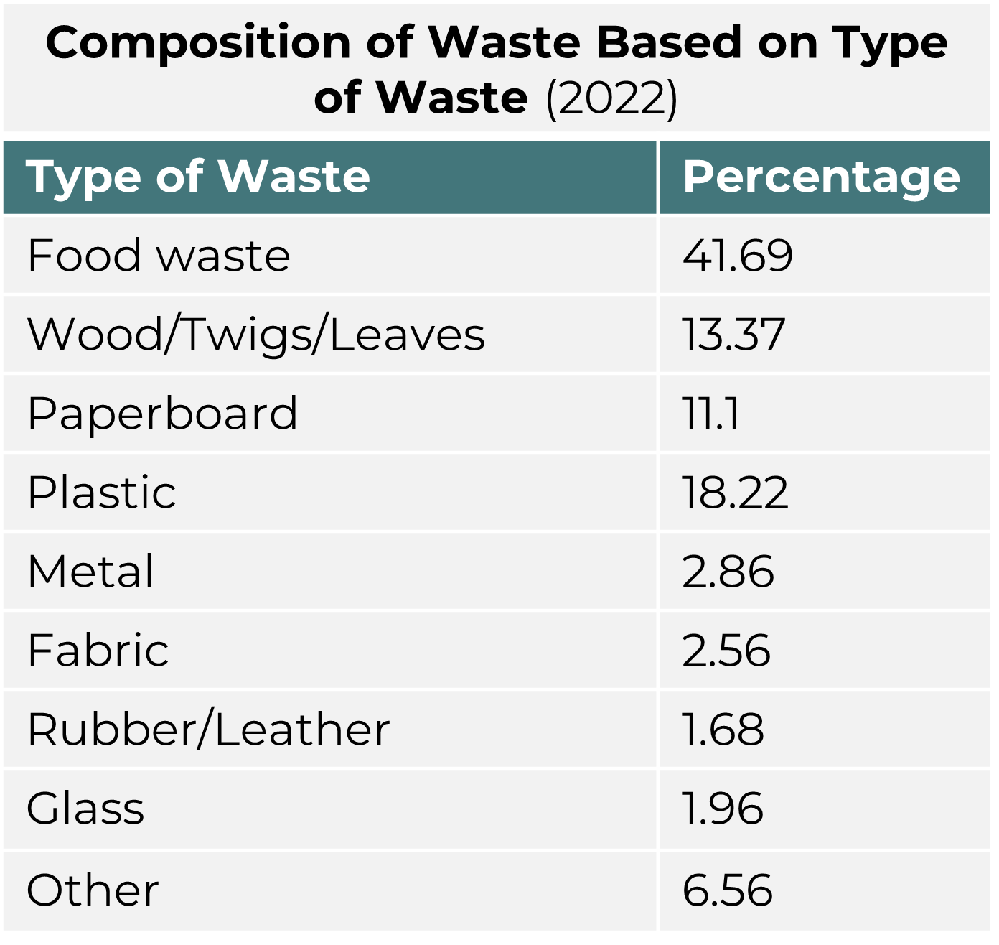
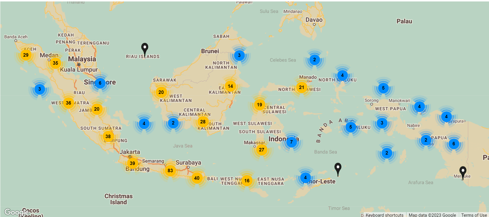
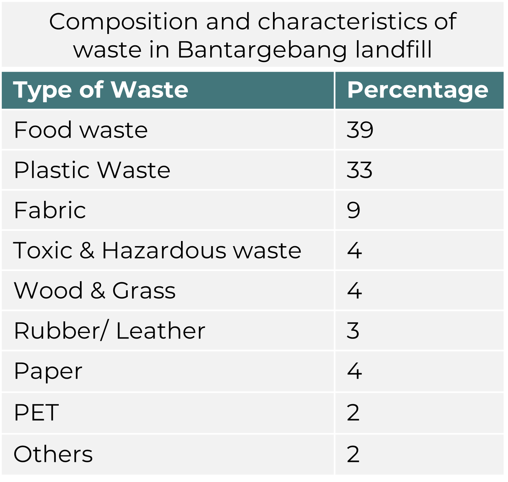
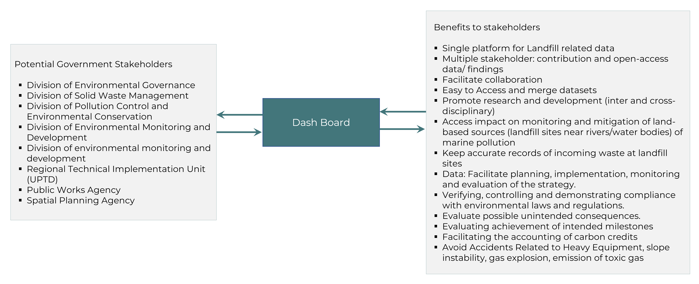
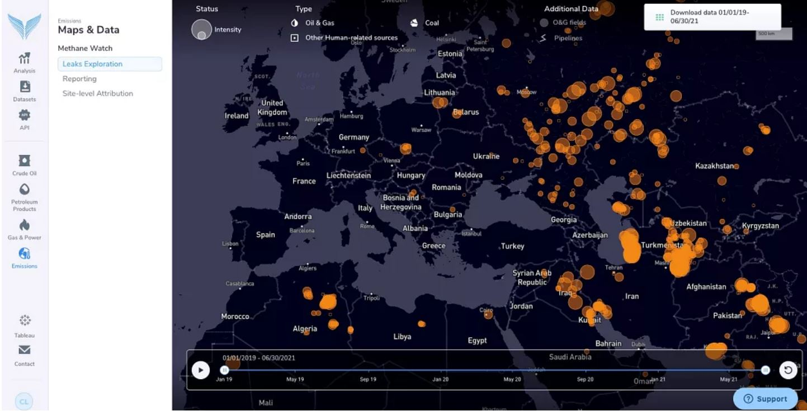

class: center middle
```{r setup, include=FALSE}
options(htmltools.dir.version = FALSE)
```

```{r xaringan-themer, include=FALSE, warning=FALSE}
library(xaringanthemer)
style_duo_accent(
  primary_color = "#327CA7",
  secondary_color = "#FFC94A",
  inverse_header_color = "#1C5174",
  inverse_text_color = "#1C5174",
  header_font_google = google_font("Ubuntu", "500"),
  text_font_google   = google_font("Montserrat", "400", "400i"),
   text_font_size = "1rem",
  code_font_google   = google_font("Fira Mono"),
  title_slide_background_image = "img/bantargebang.jpg"
)
```

```{r xaringan-all, echo=FALSE}
library(countdown)
library(xaringan)
library(xaringanExtra)
library(knitr)
hook_source <- knitr::knit_hooks$get('source')
knitr::knit_hooks$set(source = function(x, options) {
  x <- stringr::str_replace(x, "^[[:blank:]]?([^*].+?)[[:blank:]]*#<<[[:blank:]]*$", "*\\1")
  hook_source(x, options)
})

xaringanExtra::use_tile_view()
xaringanExtra::use_broadcast()
xaringanExtra::use_panelset()
xaringanExtra::use_tachyons()
xaringanExtra::use_search(show_icon = TRUE, auto_search = FALSE)
xaringanExtra::use_progress_bar(color = "#FFC94A", location = "bottom")
```

```{r load_packages, message=FALSE, warning=FALSE, include=FALSE}
library(fontawesome)
```

# Landfill Methane Emission

---
class: inverse center middle

# Problem Identification

---
## Context
.panelset[
.panel[.panel-name[Indonesia]
.pull-left[


.left[Source:<a href="https://thedocs.worldbank.org/en/doc/7c9b64c34a8833378194a026ebe4e247-0140022022/related/HCI-AM22-IDN.pdf ">worldbank</a>; <a href=" https://www.worlddata.info/asia/indonesia/index.php#:~:text=INDONESIA%2C%20the%20largest%20archipelago%20in,which%20about%206%2C000%20are%20inhabited. ">worlddata</a> <br> 
]

]
.pull-right[

.right[Source: <a href="https://www.burningcompass.com/on-world-map/indonesia-on-world-map.html
 ">burningcompass</a> <br> ]

]

]
.panel[.panel-name[Waste Management]
.pull-left[

.left[Source: <a href="https://pdf.usaid.gov/pdf_docs/PA00XWPP.pdf
 ">usaid</a> <br> ]
]

.pull-right[
- Collection:primarily by Local authorities, Informal sector, Waste Bank and Private collection
- Total Landfills= 380 nos. (area~ 8200 Ha)
- Waste Bank (Success story): Satu Hati Waste Bank in West Jakarta, established in April 2017 ( (US$511,736) in profits)
- MSW managed by Seksi Kebersihan (Cleansing Dept. in each district)
]


.panel[.panel-name[Landfill]
.pull-left[


Source: <a href=" https://sipsn.menlhk.go.id/sipsn/public/data/komposisi">sipsn</a>
]
.pull-right[


Source: <a href=" https://sipsn.menlhk.go.id/sipsn/">sipsn</a>
]

.panel[.panel-name[Bantargebang Landfill-1]
.pull-left[
- Indonesia's Biggest Landfill
- Location: Jakarta, Bekasi district.
- Waste generation: 7100 Tonnes/day (Jakarta)
- Ownership: Jakarta administration
- Area: 200 acres, Operational : 1989
- Disposal: 7000 ton (unsorted waste/day), Volume: 39Mn Tons, Height: 40m
- 3000 families live within its foot print (waste-pickers)
- Informal Sector livelihood: 1500 waste-pickers 
- Past project on site: Bantargebang Landfill Gas Management & Power Generation (capture the CH4 rich gas from the landfill to generate electricity)
]
.pull-right[
 
Source: <a href=" https://ijtech.eng.ui.ac.id/article/view/4571 ">ijtech</a>
- Landfill type: open dumping site, 5 zones, 2 leachate processing installations
- Catchment: 5 provinces, Jakarta

]
.panel[.panel-name[Bantargebang Landfill-2]
.pull-left[


Source: <a href=" https://www.ncbi.nlm.nih.gov/pmc/articles/PMC9325652/">ncbi</a>
]
.pull-right[
- Issues:
  - Environmental: air pollution (harmful gas emission), surface overflow- groundwater and soil contamination.  
  - Socio-economic: Exposure to toxic environment leading to numerous negative health impacts on 18000 residents living near, social unrest due to irregularities in compensation.
- Current mitigation measure: 5 incineration facilities(different locations in the city)
- Bantargebang:Proposed Center for waste residue processing
- Ongoing Initiative: TPST Bantargebang Landfill mining

Source: <a href=" https://ejatlas.org/conflict/bantar-gebang-jakarta-landfill-indonesia ">ejatlas</a>; <a href=" https://iopscience.iop.org/article/10.1088/1755-1315/940/1/012028/pdf ">iopscience</a>; <a href=" https://upstdlh.id/tpst/landfill ">ejatlas</a>


]
]
]
]
]
]


---
## Why is it Important

.panelset[
.panel[.panel-name[Policies]
.pull-left[

.left[Source: <a href="https://pdf.usaid.gov/pdf_docs/PA00XWPP.pdf">Policies</a>;<a href="https://www.ilo.org/dyn/natlex/natlex4.detail?p_lang=en&p_isn=84427&p_country=IDN&p_count=611">WasteLaw2008</a>;<a href="https://humanrightspapua.org/wp-content/uploads/2021/03/images_docs_Indonesian_Law_32-2009_Environment.pdf ">LawEPM2009</a>;<a href="https://www.global-regulation.com/translation/indonesia/7208771/government-regulation-number-81-in-2012.html ">MHHW2012</a> ;<a href="http://www.vertic.org/media/National%20Legislation/Indonesia/ID_Regulation_Waste_19_1994.pdf">RHWM</a>;<a href="https://faolex.fao.org/docs/pdf/ins137639.pdf ">PRT2013</a>;<a href="https://www.acccrn.net/sites/default/files/publication/attach/ran-api_english_translation.pdf ">RANAPI2015</a>;<a href="https://kkp.go.id/an-component/media/upload-gambar-pendukung/djprl/P4K/Pencemaran%20Laut/Marine%20Debris/03.%20Perpres%20Nomor%2097%20Tahun%202017%20-%20Jakstranas.pdf">NPM</a>;<a href="https://wedocs.unep.org/bitstream/handle/20.500.11822/32898/NPWRSI.pdf?sequence=1&isAllowed=y ">NPWR2020</a>;<a href="https://drive.esdm.go.id/wl/?id=NMWtlg7uDxwXTf1bDxgrren7d8x6y5Iu&mode=list&download=1 ">WE</a>;<a href="https://unfccc.int/sites/default/files/NDC/2022-09/23.09.2022_Enhanced%20NDC%20Indonesia.pdf ">ENDC2022</a>;<a href="https://www.basel.int/Portals/4/Basel%20Convention/docs/text/BaselConventionText-e.pdf ">Basel2005</a>;<a href="https://jdih.kemendag.go.id/backendx/image/regulasi/22200711_Permendag_No._31_tahun_2016.pdf">wasteImport</a>;<a href="https://documents1.worldbank.org/curated/en/781051510608417715/Environmental-and-social-management-framework.pdf">SWMS2019</a>;<a href="https://drive.google.com/file/d/16WhKUeXjd7LnpiVJADhFtye8w-4G9aHj/view">MoEF2019</a>; <a href="https://www.wwf.id/upload/2023/03/WWF-EPR-Guideline-2022-ENG-final.pdf">EPR2015</a> 

]
]

.pull-right[
- Indonesia aims to reduce marine plastic litter by 70% relative to business as usual by 2025
<a href="https://www.oecd.org/ocean/topics/ocean-pollution/marine-plastics-pollution-Indonesia.pdf">OECD</a> <br>
- Government: enhancement of SWM and Environmental Improvement
- Focus on waste reduction and management Plan, 'reuse and recycle', 
- Policies emphasise monitoring waste-associated activities (Generation, collection, reduction, disposal, recycling etc.)
- Based on the monitoring of waste-associated activities evaluation step is to be conducted. 
- _Gerakan Pilah Sampah_: waste sorting at source > Circular Economy
- ADIPURA Programme, MoEF (incentive to Municipalities):Environmental Management, Cleanliness and Operation of final disposal site. 
]

]
.panel[.panel-name[Gap]
.pull-left[


]


.pull-right[


Source: <a href="https://wedocs.unep.org/bitstream/handle/20.500.11822/32898/NPWRSI.pdf?sequence=1&isAllowed=y ">unep</a>
]

.panel[.panel-name[Our Focus]

- Improving and Reviewing data acquisition and management system
- Reviewing and improving O&M of landfill
- Assisting Local governments in relevant decision making
]

.panel[.panel-name[Impact]
.pull-center[



]
]
]
]
---
class: inverse center middle

# Approach

---

##Interactive Dashboard
```{r xaringan-panelset, echo=FALSE}
xaringanExtra::use_panelset()

```
.panelset[
.panel[.panel-name[Introduction]
.pull-left[
**Objective<br/>**
- Monthly monitoring on the emission and surface temperature of Bantargebang Landfill
- Monthly environmental impact assessment at and around the landfill site
- Effective dissemination of information on the latest situation


**Website<br/>**
Official Jakarta Waste Management Portal <br/> 'e-Monitoring for Bantargebang Landfill'

**Parameters**
- Methane Emission
- Surface Temperature
- Environmental Monitoring 
]

.pull-right[

]
]

.panel[.panel-name[Methods]

]

.panel[.panel-name[Dataset]

]

.panel[.panel-name[Model]
**Methane Emission: LandGEM**
.pull-left[
This model is based on a first-order biogas generation model that estimates emission rates for each landfill
- Assumes 75% of biogas is captured and 10% is oxidised 
- Depends on:
  1. Annual reported tonnage of waste
  2. Default biogas yield per unit waste constant
  3. Kinetic decay constant

]
.pull-right[


]
]

]

---
class: inverse center middle

# Project Output

---

## Landfill Monitoring Dashboard

The output of this project includes a map of methane emissions from the Bantargebang landfill and an estimation of the total emissions from the site. This information can be used by stakeholders to better understand the extent of the methane emission problem at the landfill and to develop strategies for reducing those emissions.
.pull-left[
]
.pull-right[
]]
---

## Landfill Monitoring Dashboard

.panelset[
.panel[.panel-name[Usefulness]

1. **Improved public health and environmental outcomes**<br>Reducing methane emissions from landfills can improve air quality, reduce greenhouse gas emissions, and minimize the risk of fires and explosions.

2. **Increased efficiency of methane mitigation strategies**<br>With periodical data on methane emissions, landfill operators can optimize their methane mitigation strategies, which can help to reduce overall emissions.

3. **Reduced costs**<br>By optimizing methane mitigation strategies, landfill operators can reduce the cost of mitigating methane emissions.

]

.panel[.panel-name[Utilisation]

]

.panel[.panel-name[Limitations]

1. **Limited availability of satellite imagery**<br>The project heavily relies on the availability of satellite imagery to monitor methane emissions from the landfill. However, cloud cover and other atmospheric conditions can impact the quality and availability of satellite imagery, which can limit the accuracy of the methane emission estimates.

2. **Limited temporal resolution**<br>The project relies on satellite imagery with limited temporal resolution. Frequent updates are needed to accurately monitor methane emissions from landfills, and more frequent satellite imagery could provide more accurate and up-to-date estimates.

3. **Limited spatial resolution**<br>The spatial resolution of satellite imagery can also limit the accuracy of methane emission estimates, especially in cases where methane emissions are highly localized. Other resources such as aerial imagery which has very high spatial resolution can be added in the future works.

]

.panel[.panel-name[Future Works]

1. **Expanding the analysis to other landfills**<br>This project focused on the Bantargebang landfill in Jakarta, Indonesia. Similar analyses could be conducted for other landfills around Indonesia to better understand the national methane emissions problem from landfills and contribute to national strategic plan to reduce greenhouse gas emission.

2. **Incorporating other data sources**<br>This project used satellite data to estimate methane emissions. Additional data sources, such as ground-based sensors and drone-based imagery, could be incorporated into the analysis to improve the accuracy of methane emission estimates.

3. **Developing predictive models**<br>By analyzing historical data on methane emissions and other relevant factors, predictive models could be developed that could help landfill operators to proactively manage methane emissions and optimize their mitigation strategies.

]

]

---
class: inverse center middle

# Plan

---
## Project Plan

.panelset[
.panel[.panel-name[**Team**]


]

.panel[.panel-name[**Workflow**]


]

.panel[.panel-name[**Timeline**]


]

.panel[.panel-name[**Value for Money**]


]
]

---
class: inverse center middle

# Risk Management

---
## Risk Management

.panelset.sideways[
.panel[.panel-name[**Data acquisition**]

There may be challenges in acquiring reliable satellite data due to poor weather conditions or satellite malfunction. 

Mitigation strategy: Have backup plans in place such as purchasing data from multiple sources and scheduling satellite passes at different times to increase the chance of obtaining good quality data.


]

.panel[.panel-name[**Technical**]

The processing of satellite imagery and the estimation of methane emissions requires advanced technical expertise. 

Mitigation strategy: Ensure that the team members responsible for data processing and analysis are highly skilled and trained in the latest techniques and technologies. This is can be ensured in the recruiting process.

]

.panel[.panel-name[**Human resources**]

There may be difficulties in hiring and retaining qualified personnel for the project. The other possibility is human resources terminate the contract before the project ended. The project team might face the risk of losing the resources before the project is completed. This can cause a delay in the project timeline and could lead to additional costs to recruit new resources.

Mitigation strategy: Create a competitive compensation package and offer professional development opportunities to retain top talent.The project manager should ensure that the project team members are committed to the project and have signed a contract to complete the project. The project manager should also maintain open communication with the team members and address any issues or concerns that arise during the project. If a team member needs to be replaced, a contingency plan should be in place to minimize the impact on the project timeline. Additionally, the project manager should identify and document the knowledge and skills of each team member to ensure a smooth transition if a team member needs to be replaced.

]

.panel[.panel-name[**Operational**]

There may be issues with the operation of the methane monitoring dashboard such as data transmission failure, software malfunctions or hacking. 

Mitigation strategy: Perform regular maintenance and software updates on the dashboard and implement security measures to prevent unauthorized access.

]

.panel[.panel-name[**Financial**]

The project budget may exceed the allocated funds due to unforeseen expenses or cost overruns. 

Mitigation strategy: Set aside contingency funds to cover unexpected expenses and regularly monitor project expenses to stay within budget.

]

.panel[.panel-name[**Stakeholders**]

There may be disagreements or conflicts with stakeholders on project objectives or implementation strategies. 

Mitigation strategy: Hold regular meetings with stakeholders to ensure transparency and open communication, and be open to feedback and suggestions.

]
]

---
class: inverse center middle

# Implementation

---
## Project Implementation

.panelset.sideways[
.panel[.panel-name[**Workflow**]

Put flowchart in this

]

.panel[.panel-name[**ROI**]

ROI 

]
]
